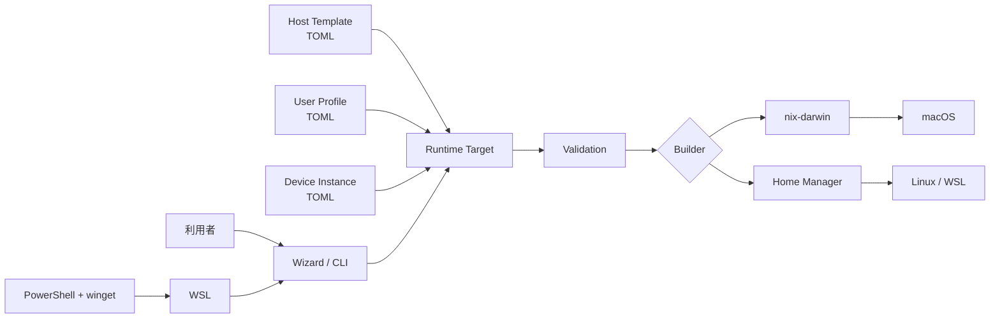
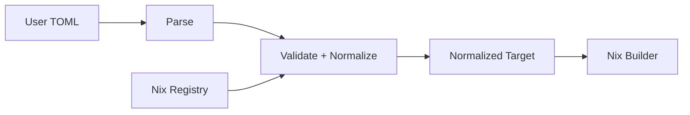

# nix-station システム設計

> [!IMPORTANT]
> この文書は目標アーキテクチャの全体構造と主要判断を所有します。詳細設計は
> [`architecture/`](architecture/README.md)、実装状況は
> [`移行状況`](architecture/README.md#3-移行状況)を参照してください。

## 目次

- [1. この文書の責任](#1-この文書の責任)
- [2. 主要な設計判断](#2-主要な設計判断)
- [3. システム全体像](#3-システム全体像)
- [4. 責務境界](#4-責務境界)
- [5. 詳細設計の責任](#5-詳細設計の責任)
- [6. TOMLとNixの境界](#6-tomlとnixの境界)
- [7. nix-station固有の構造制約](#7-nix-station固有の構造制約)

## 1. この文書の責任

[`REQUIREMENTS.md`](REQUIREMENTS.md)の要求を、どの責任へ分割し、どう接続するかを
定義します。利用手順は[`SETUP.md`](SETUP.md)、開発手順は
[`DEVELOPMENT.md`](DEVELOPMENT.md)が所有します。

## 2. 主要な設計判断

| 判断 | 採用方針 | 詳細設計 |
|---|---|---|
| Host | 個人情報を持たない共有Template | [`InstanceとDeployment`](architecture/instance-and-deployment.md) |
| Profile | Hostへ固定せず適用時に選択 | [`InstanceとDeployment`](architecture/instance-and-deployment.md) |
| Instance | リポジトリ外へ保存 | [`InstanceとDeployment`](architecture/instance-and-deployment.md) |
| Role | 廃止し挙動をTemplateへ明示 | [`InstanceとDeployment`](architecture/instance-and-deployment.md) |
| Deploy | Instance内のlocal flakeへ分離 | [`InstanceとDeployment`](architecture/instance-and-deployment.md) |
| App | App Catalogを正本にしてBrewfileとDockを生成 | [`App CatalogとDock`](architecture/app-management.md) |
| Test | Registryとパス規約から追跡 | [`TestとCI`](architecture/testing.md) |
| Wizard | 初回対話UIに限定しApplication Serviceを共有 | [`ユーザーワークフロー`](architecture/user-workflow.md) |

判断の経緯は
[`Decision Record`](decisions/2026-06-21-issue-36-system-architecture.md)に保存します。

## 3. システム全体像

対応OSと管理範囲は[`REQUIREMENTS.md`](REQUIREMENTS.md#10-対応範囲)が正本です。

## 4. 責務境界

| 概念 | 責任 | 責任範囲外 |
|---|---|---|
| Framework | Module、検証、構成生成 | 個人情報、実機状態 |
| Host Template | OS、system、機能・アプリ選択 | username、hostname、秘密情報 |
| User Profile | username、Git identity | OS、端末機能 |
| Device Instance | hostname、選択Template | Module定義 |
| Registry | 機能ID、Module、対応環境 | Profile、Test path、実行状態 |
| Builder | 検証済みTargetの成果物化 | 対話入力、秘密情報管理 |
| Wizard | 初回対話と適用確認 | Nix導入、評価・ビルドロジック |

依存は入力、検証、構成生成、Module、Builderの一方向にします。下位Moduleから
Hostファイルやユーザーインターフェースを参照しません。

## 5. 詳細設計の責任

| 詳細設計 | 所有する契約 |
|---|---|
| [`instance-and-deployment.md`](architecture/instance-and-deployment.md) | Host、Profile、Instance、local flake、適用、rollback |
| [`user-workflow.md`](architecture/user-workflow.md) | 初回利用フロー、Wizard、Application Service |
| [`app-management.md`](architecture/app-management.md) | App Catalog、Brewfile、Dock、導入失敗 |
| [`testing.md`](architecture/testing.md) | Test階層、Registry追跡、CI、レビュー基準 |

## 6. TOMLとNixの境界

利用者が編集するHost、Profile、Instance、App Catalogは`schema_version`付きTOMLとします。
ValidatorがTOMLを正規化済みNix attrsetへ変換し、利用者はNix pathではなくRegistry IDを
選択します。

Module、Registry、Validator、Builderは、path、関数、optionを自然に表現できるNixで
実装します。この境界により、利用者向けインターフェースと内部実装を分離します。

## 7. nix-station固有の構造制約

- `flake.nix`はinputとoutput編成に集中します
- 新しいHost、Profile、機能の追加だけでコア変更を発生させません

汎用的なModule責任、ファイル分割、README、Test構造の規約は
`$design-maintainable-system`から継承し、この文書では再定義しません。
