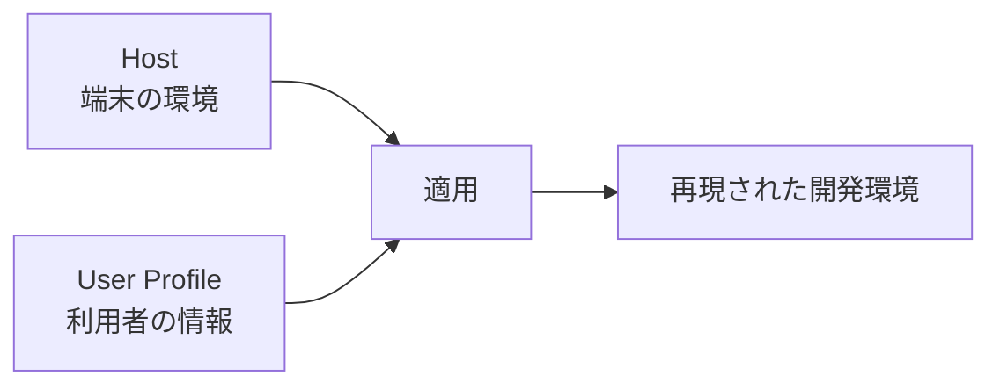

# nix-station 要件定義

> [!NOTE]
> この文書は「なぜ作るのか」「誰に何を提供するか」を定義します。
> 内部構造や実装方法は[`DESIGN.md`](DESIGN.md)へ委譲します。

## 目次

- [1. プロダクトメッセージ](#1-プロダクトメッセージ)
- [2. 解決する課題](#2-解決する課題)
- [3. なぜNixなのか](#3-なぜnixなのか)
- [4. なぜHostとUser Profileなのか](#4-なぜhostとuser-profileなのか)
- [5. 提供する価値](#5-提供する価値)
- [6. 対象ユーザー](#6-対象ユーザー)
- [7. 成果物のイメージ](#7-成果物のイメージ)
- [8. 利用体験](#8-利用体験)
- [9. 必須要件](#9-必須要件)
- [10. 対応範囲](#10-対応範囲)
- [11. 成功条件](#11-成功条件)
- [12. 対象外](#12-対象外)

## 1. プロダクトメッセージ

nix-stationは、複数デバイスの開発環境を何度でも簡単に再現するための
ガイド付きクロスプラットフォーム開発環境管理基盤です。

非Nixユーザーでもウィザードから利用を開始でき、慣れてきたらHostと
User Profileを編集して、自分やチーム向けの宣言的な環境管理へ移行できます。

## 2. 解決する課題

エンジニアはPCの追加・交換・初期化のたびに、Zsh、Git、tmux、CLIツール、
エディタ、ターミナル、GUIアプリなどを再設定している。この作業は時間がかかり、
端末ごとの差分、設定漏れ、属人的な手順を生みやすくなります。

nix-stationは端末とユーザーの設定を再利用可能な形で残し、環境構築を
「記憶と手作業」から「選択と適用」へ変えます。

## 3. なぜNixなのか

nix-stationが解決したいのは、ツールを一度インストールすることではなく、
端末を初期化しても同じ開発環境を繰り返し再現できることです。

一般的なセットアップスクリプトは操作手順を自動化するが、Nixはパッケージ、
設定ファイル、ユーザー環境などの望ましい状態を宣言として管理できます。
設定をGitで履歴管理し、差分をレビューし、固定した依存関係から再構築できるため、
複数端末の継続的な管理に適しています。

一方、Nixには独自の概念と学習コストがあります。nix-stationはHost、User Profile、
セットアップウィザードを入口として初期導入を簡単にします。Nixを完全に隠すのではなく、
セットアップ後は宣言と正式な適用方法を示し、段階的にNixへ移行できるようにします。

再現できるのはNixや関連ツールで宣言した範囲であり、秘密情報、外部サービスの状態、
未管理のGUI設定、ハードウェア固有状態まで完全に再現するものではありません。

## 4. なぜHostとUser Profileなのか

端末のOS、用途、導入アプリは「端末側の都合」で変わる。一方、usernameや
Git identityは「利用者側の都合」で変わる。変更理由と共有範囲が異なる情報を
1つの設定へ混在させると、別端末・別ユーザーへ再利用しにくくなります。

nix-stationは次の2つを利用者向けインターフェースとして分離します。

- **Host**: どのような端末環境を作るか
- **User Profile**: 誰の環境として適用するか

適用時に両者を組み合わせることで、1つのHostを複数利用者で共有し、1つのProfileを
複数端末で再利用できます。内部のNix構造を知らなくても、利用者が変更箇所を判断しやすくなります。

## 5. 提供する価値

- 初期化した端末でも同じ開発環境へ戻しやすい
- 複数デバイスの共通設定と個別設定を一元管理できる
- 新しいHostやUser Profileを追加しやすい
- 環境構築手順を個人、チーム、組織で共有できる
- 手作業、設定漏れ、端末間のばらつきを減らせる
- 利用しながらNixによる宣言的管理を学べる

## 6. 対象ユーザー

主な対象は、複数デバイスで開発を行う非Nixユーザーのエンジニアです。

- PCの追加や初期化が多い個人開発者
- macOS、Linux、WSLを併用するエンジニア
- 開発環境をチームで統一したい組織
- Nixに興味はあるが、最初から設定を組むのは難しい利用者

## 7. 成果物のイメージ

- 対話形式で初期構築を進めるセットアップウィザード
- 端末ごとの環境を表すHost設定
- ユーザーごとの情報を表すUser Profile
- Zsh、Git、tmux、CLIツールなどの再利用可能な設定
- macOSとWindowsで使用するアプリの導入支援
- 設定変更と再適用の方法を説明するガイド

## 8. 利用体験

利用者はガイド付きの初回導入から開始し、適用内容を確認してから環境を構築できます。
導入後は設定場所と正式な再適用方法を理解し、HostとUser Profileを自分や組織向けに
育てられることを要求します。

具体的な操作順序とWizardの責任は
[`ユーザーワークフロー設計`](architecture/user-workflow.md)が所有します。

## 9. 必須要件

- ZIPとGit cloneのどちらからでも利用を開始できる
- Nixは利用者が公式手順から手動でインストールする
- Nixの操作経験がなくても、その後のセットアップを進められる
- HostとUser Profileを選択または追加できる
- 実行環境と互換性のないHostを誤って適用しない
- 適用前に対象と変更内容を確認できる
- 再実行しても既存環境を不必要に壊さない
- 端末固有設定とユーザー固有設定を分けて管理できる
- 個人情報や秘密情報を標準で共有リポジトリへ含めない
- 新しい端末やユーザーの追加が既存利用者へ影響しない
- 失敗時に原因と利用者が取るべき対応を表示する
- セットアップ後に日常的な変更と再適用の方法を案内する

## 10. 対応範囲

| 対象 | 提供するもの |
|---|---|
| macOS | システム設定、ユーザー環境、アプリ導入支援 |
| Linux | ユーザー環境の構築 |
| WSL | Linuxユーザー環境とWSL向け設定 |
| Windows本体 | wingetによるアプリとWSLの導入支援 |

## 11. 成功条件

- READMEとウィザードだけでセットアップを開始できる
- 新規または初期化済み端末に既存環境を再現できる
- HostとUser Profileを別の端末・ユーザーへ再利用できる
- セットアップ後、利用者が設定の変更場所と再適用方法を説明できる
- 個人情報なしでリポジトリを配布・検証できる
- HostやUser Profileが増えても同じ方法で管理できる

## 12. 対象外

- すべてのOS設定やGUIアプリ内部の状態を完全に再現すること
- 秘密情報管理システムそのものを提供すること
- Windows本体をNixで管理すること
- Nixの存在を完全に隠すこと

内部構造、責務分割、評価・ビルド・適用、テスト戦略、拡張方式は
[`DESIGN.md`](DESIGN.md)で定義します。
