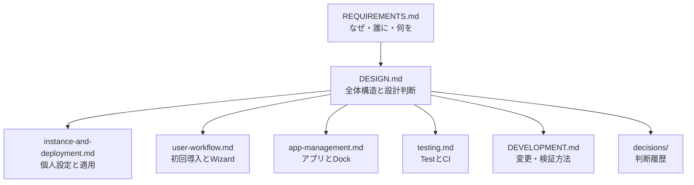

# アーキテクチャ索引

> [!IMPORTANT]
> このディレクトリはnix-stationの目標アーキテクチャを説明します。
> 記載内容には、現在のブランチでまだ実装されていない設計が含まれます。

## 目次

- [1. 読み方](#1-読み方)
- [2. 文書マップ](#2-文書マップ)
- [3. 移行状況](#3-移行状況)

## 1. 読み方

| 読者 | 推奨する順番 |
|---|---|
| 初めて見る人 | `REQUIREMENTS` → `DESIGN` → 興味のある詳細設計 |
| 設計レビュー担当 | `DESIGN` → 詳細設計 → Decision Record |
| 実装担当 | `DESIGN` → `DEVELOPMENT` → 対象ModuleのREADME |

## 2. 文書マップ

| 文書 | 答える問い |
|---|---|
| [`REQUIREMENTS.md`](../REQUIREMENTS.md) | なぜ必要で、利用者に何を提供するか |
| [`DESIGN.md`](../DESIGN.md) | どの責任へ分け、どう接続するか |
| [`instance-and-deployment.md`](instance-and-deployment.md) | 個人設定をどこへ置き、どう適用するか |
| [`user-workflow.md`](user-workflow.md) | 利用者がどう導入し、Wizardが何を担当するか |
| [`app-management.md`](app-management.md) | BrewとDockをどう一貫管理するか |
| [`testing.md`](testing.md) | ModuleとTestをどう対応させるか |
| [`DEVELOPMENT.md`](../DEVELOPMENT.md) | 開発者がどう変更・検証するか |

## 3. 移行状況

| 領域 | 現行 | 目標 | 状態 |
|---|---|---|---|
| Host | Nix、実機名・Profile参照を保持 | 共有TOML Template | 未実装 |
| Profile | リポジトリ内のNixファイル | Instance内のTOML | 未実装 |
| Deploy | Root flakeの全Host output | 選択Targetのlocal flake | 未実装 |
| Role | Module分岐に使用 | 廃止し設定を明示 | 完了 |
| App | BrewfileとDockを別管理 | App Catalogから生成 | 未実装 |
| Test | 一部が実装と対応 | Registry駆動で全Moduleを追跡 | 未実装 |

> [!NOTE]
> 移行が完了するまでは、利用コマンドと開発手順について現行のOS別ガイドを優先します。
