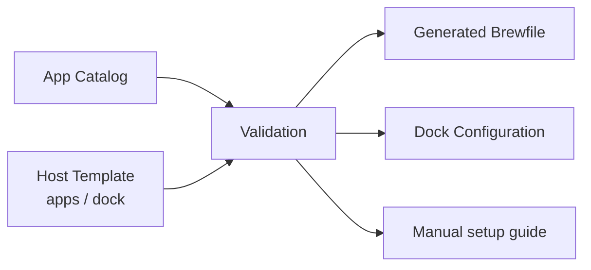

# App CatalogとDock設計

> [!NOTE]
> Homebrew、MAS、wingetは導入支援であり、Nix storeと同じ再現性は保証しません。

## 目次

- [1. 解決する課題](#1-解決する課題)
- [2. 判断](#2-判断)
- [3. データモデル](#3-データモデル)
- [4. 生成フロー](#4-生成フロー)
- [5. 失敗時の動作](#5-失敗時の動作)
- [6. 安全性](#6-安全性)
- [7. トレードオフ](#7-トレードオフ)

## 1. 解決する課題

BrewfileとDockのアプリパスを別々に管理すると、名称変更、削除、順序変更のたびに
複数箇所を修正する必要があります。一方、DockにはmacOS標準アプリや手動導入アプリも
含まれるため、Brewfileだけを正本にはできません。

## 2. 判断

App Catalogをアプリ情報のSingle Source of Truthとします。Host Templateは、導入する
`apps`と順序付き`dock`をCatalogのIDで参照します。



## 3. データモデル

| 導入方式 | 用途 | Brewfile出力 |
|---|---|---|
| `homebrew-cask` | Homebrew GUIアプリ | cask |
| `mas` | Mac App Storeアプリ | mas |
| `system` | macOS標準アプリ | なし |
| `manual` | 自動導入できないアプリ | なし、手順を表示 |

```toml
[apps.chrome]
install = "homebrew-cask"
package = "google-chrome"
macos_path = "/Applications/Google Chrome.app"

[apps.notes]
install = "system"
macos_path = "/System/Applications/Notes.app"
```

## 4. 生成フロー

1. CatalogとHost Templateをschema検証する
2. `apps`からlocal Brewfileを生成する
3. HomebrewとMASによる導入を実行する
4. `dock`を順番に解決する
5. 実在する`.app`だけをDockへ配置する
6. 不足アプリと再適用方法を表示する

> [!TIP]
> インストールするがDockへ置かないアプリ、Dockへ置くmacOS標準アプリを同じID体系で
> 扱えることが、CatalogをBrewfileより上位に置く理由です。

## 5. 失敗時の動作

- CatalogにないIDは適用前エラーにする
- 必須フィールド不足はschemaエラーにする
- MAS未認証は他の導入結果と分けて表示する
- manualアプリは手順を表示し、全体を失敗扱いにしない
- App pathが存在しない場合はDock配置をskipして警告する
- Dock再適用を冪等にする

## 6. 安全性

`brew bundle cleanup`はアプリを削除するため自動実行しません。削除候補を表示し、利用者の
明示操作にします。生成BrewfileはInstanceの`generated/`へ置き、手編集しません。

## 7. トレードオフ

Catalogと生成処理が増える一方、アプリID、導入方式、path、Dock順序の重複をなくせる。
Windowsのwingetは当面別管理とし、共通Catalogへ無理に統合しません。
