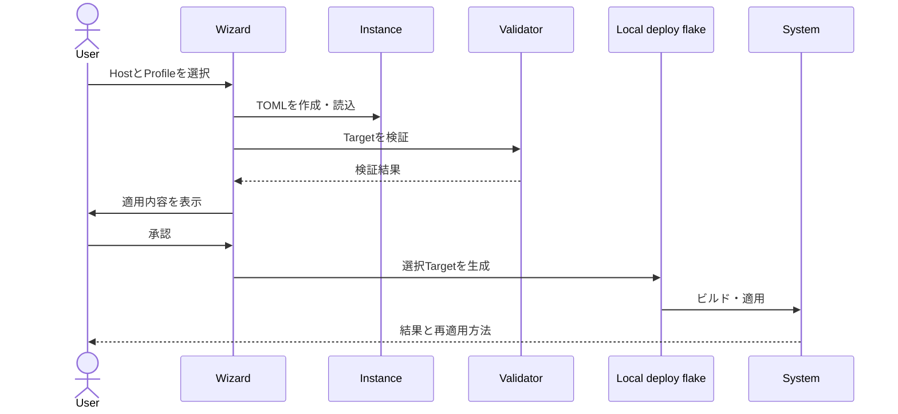

# InstanceとDeployment設計

> [!NOTE]
> この文書は目標設計です。現行実装はまだRoot flake内でHostとProfileを結合しています。

## 目次

- [1. 解決する課題](#1-解決する課題)
- [2. 検討した選択肢](#2-検討した選択肢)
- [3. 判断](#3-判断)
- [4. データ構造](#4-データ構造)
- [5. 適用フロー](#5-適用フロー)
- [6. 安全性と更新](#6-安全性と更新)
- [7. トレードオフ](#7-トレードオフ)
- [8. 未決事項](#8-未決事項)

## 1. 解決する課題

共有リポジトリのHostが個人Profileやhostnameを直接参照すると、次の問題が起きます。

- 個人設定がない環境でFramework全体を評価できない
- setupがGit管理対象のHostを書き換える
- ZIPを更新すると個人設定を失う可能性がある
- 同じHostを別ユーザーが再利用しにくい

## 2. 検討した選択肢

| 選択肢 | 利点 | 問題 |
|---|---|---|
| HostへProfileを埋め込む | 実装が単純 | 共有設定と個人設定が混在する |
| リポジトリ内のignored領域へ保存 | 発見しやすい | ZIP更新やディレクトリ削除に弱い |
| リポジトリ外のInstanceへ保存 | Frameworkと独立して更新できる | 適用時にFrameworkとの接続が必要 |

## 3. 判断

個人・組織固有のInstanceを`~/.config/nix-station`へ保存し、`--config-dir`で
別ディレクトリも指定可能にします。Instance内のlocal deploy flakeがFrameworkを
inputとして参照します。

> [!IMPORTANT]
> Root flakeはFramework Qualityだけを評価します。個人Profileを必要とするDeploy Outputを
> Root flakeへ含めません。

## 4. データ構造

```text
~/.config/nix-station/
├── instance.toml        # hostname、選択Hostなど実機固有値
├── profiles/
│   └── <profile>.toml   # username、Git identity
├── flake.nix            # Generated local deploy flake
├── flake.lock           # 使用するFramework revision
└── generated/
    └── Brewfile
```

| データ | 所有者 | Git管理 |
|---|---|---|
| Host Template | Frameworkまたは組織 | する |
| User Profile | 利用者または組織 | 標準ではしない |
| Device Instance | 利用者 | しない |
| local deploy flake | Wizard生成 | しない |

## 5. 適用フロー



## 6. 安全性と更新

- Instanceディレクトリは利用者だけが書き込める権限にする
- Profileへtoken、password、秘密鍵を保存しない
- TOMLは一時ファイルへ書き、検証後にatomic renameする
- 生成flakeには「手編集禁止」と生成元を記載する
- sudo実行前にTarget、生成元、適用コマンドを再表示する
- `schema_version`と対応Framework versionを検証する
- Framework更新時はlocal flakeを再生成し、適用前にbuildだけ実行する
- 更新失敗時は前の`flake.lock`とNix generationへ戻せるようにする

## 7. トレードオフ

Instance分離によりファイル数と接続処理は増えます。一方で、個人情報の分離、ZIP更新、
組織利用、Framework checkの純粋性を同時に実現できます。接続の複雑さはWizardと
生成flakeへ閉じ込めます。

## 8. 未決事項

- WizardがInstanceを新規作成する具体的な対話フロー
- Frameworkのpath指定とrevision固定方法
- Profile共有モードの権限とGit管理方法
- rollbackをWizardから提供する範囲
