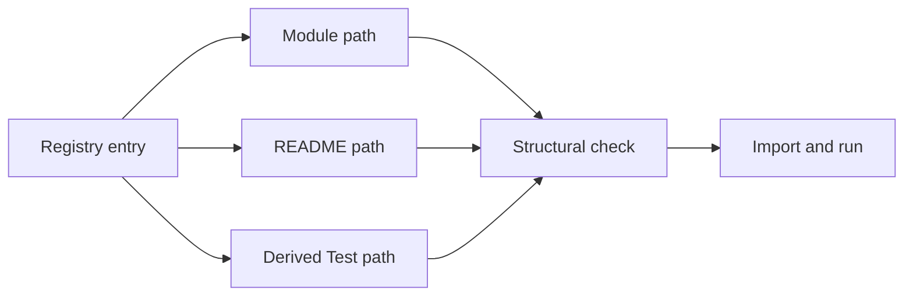
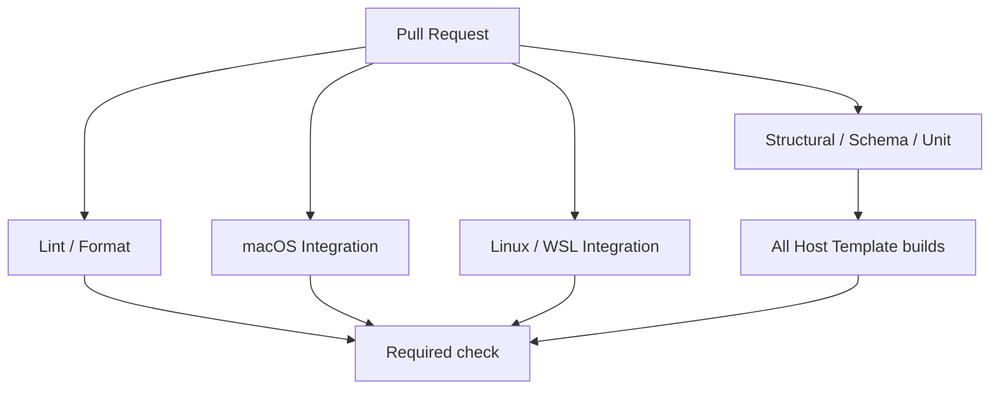

# TestとCI設計

## 目次

- [1. 目的](#1-目的)
- [2. 実装との対応](#2-実装との対応)
- [3. Test階層](#3-test階層)
- [4. Registryによる構造検査](#4-registryによる構造検査)
- [5. CIフロー](#5-ciフロー)
- [6. レビュー方針](#6-レビュー方針)

## 1. 目的

Testの有無と責任範囲を、実装パスから発見できるようにします。すべての組み合わせを
総当たりするのではなく、Schemaを網羅し、Moduleを単体検証し、代表構成を統合します。

## 2. 実装との対応

実装とTestは同じ相対構造にします。

```text
modules/home/git/
├── README.md
└── default.nix

tests/modules/home/git/
└── default.nix
```

登録済みModuleのREADMEには、責任、範囲外、入力、出力・副作用、対応Testを記載します。

## 3. Test階層

| 層 | 保証する内容 | 実行対象 |
|---|---|---|
| Structural | Module、README、Testが存在する | Registry全件 |
| Schema | 必須値、型、互換性 | 全schema分岐 |
| Unit | Module単体の公開責任 | 各Module |
| Routing | IDから正しいModuleを選ぶ | Registry全件 |
| Integration | Module間の接続 | OS別の代表構成 |
| Host build | Templateを成果物へ変換できる | 全Host Template |
| Deploy | 実機へ安全に適用できる | 手動確認 |

> [!IMPORTANT]
> Testファイルの存在は品質の十分条件ではありません。正常・無効・異常系がModuleの
> 公開責任を検証しているか、レビューで確認します。

## 4. Registryによる構造検査

RegistryはModule path、説明、対応OS・system、設定種別を持ちます。Test pathは本番Registryへ
保存せず、命名規則から導出します。



構造検査は次を失敗として扱います。

- Moduleがない
- READMEがない
- 対応Testがない
- Testをimportできない
- Registryに存在しない孤立Testがある
- 対応systemの`checks`へ登録されていない

## 5. CIフロー



OS・Tool・Profileの全組み合わせは作らない。SchemaとRoutingを網羅し、Integrationは
代表構成、Host buildは`test` Profileを使用します。

## 6. レビュー方針

- Testは内部実装ではなく公開される設定結果を検証する
- source文字列検査は評価結果を取得できない場合の最終手段にする
- Testが約200行を超えたら、設定値、Routing、副作用など振る舞い別に分割する
- 実機依存の確認項目は自動Testと混同せず、手動確認として記録する
