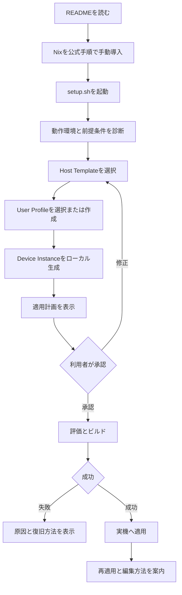
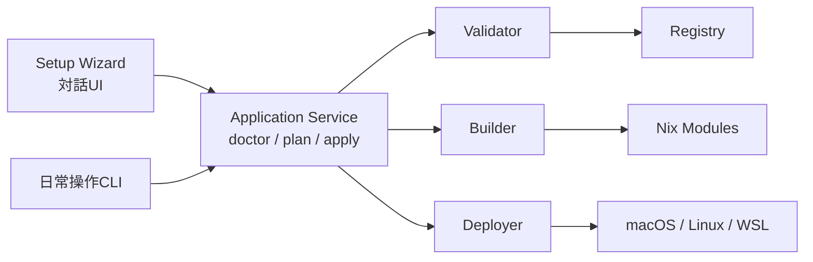

# ユーザーワークフローとSetup Wizard設計

> [!IMPORTANT]
> Setup Wizardは初回導入の案内役です。Nixの評価・ビルド・適用ロジックそのものは
> Wizardへ実装せず、日常操作と共有できるApplication Serviceへ委譲します。

## 目次

- [1. 設計目標](#1-設計目標)
- [2. 初回セットアップ](#2-初回セットアップ)
- [3. セットアップ後の利用](#3-セットアップ後の利用)
- [4. 責任境界](#4-責任境界)
- [5. 内部構造](#5-内部構造)
- [6. 失敗と再実行](#6-失敗と再実行)
- [7. 完了条件](#7-完了条件)

## 1. 設計目標

非Nixユーザーが安全に初回適用を完了し、その後はHostとUser Profileを編集しながら
宣言的な管理と正式な適用方法を段階的に学べる体験を提供します。

WizardはNixを隠すものではありません。実行する処理、変更対象、再適用コマンドを表示し、
利用者が何を適用したか説明できる状態を目指します。

## 2. 初回セットアップ

1. 利用者がNixを公式手順で手動導入します
2. WizardがOS、Nix、権限、必要コマンドを診断します
3. 利用者がHost TemplateとUser Profileを選択します
4. Wizardがリポジトリ外へDevice Instanceを生成します
5. Wizardが変更対象、実行コマンド、副作用を表示します
6. 利用者の承認後に、評価、ビルド、適用を順番に実行します
7. Wizardが結果、設定場所、再適用方法を表示します

> [!NOTE]
> Windows本体では`setup.ps1`がwingetとWSL導入を支援します。Nixによるセットアップは
> WSL内で`setup.sh`を起動して続行します。

## 3. セットアップ後の利用

初回適用後は、Wizardだけに依存せず次の順番でNixの操作へ移行します。

1. HostまたはUser ProfileのTOMLを編集します
2. `nix-station plan`で変更内容を確認します
3. `nix-station apply`で再適用します
4. 必要に応じて`darwin-rebuild`や`home-manager`の直接操作を学びます

`nix-station`コマンドの実装方式は実装フェーズで決定します。ただし、WizardとCLIは同じ
Application Serviceを利用し、検証・適用処理を重複させません。

## 4. 責任境界

| Wizardが担当すること | Wizardが担当しないこと |
|---|---|
| OS、Nix、権限、必要コマンドの診断 | Nixの自動インストール |
| 既存Instanceの検出 | リポジトリ内Hostへの個人情報書き込み |
| HostとProfileの選択・作成支援 | Nixファイルの文字列解析・置換 |
| OSとHostの互換性検証 | `/etc`などの暗黙的な変更 |
| 適用計画と副作用の表示 | 秘密情報の収集・保存 |
| 利用者の明示的な承認 | Brew cleanupなどの破壊的処理 |
| 共通Serviceへの処理委譲 | Git commit、push |
| 結果、復旧、再適用方法の表示 | App Storeなど外部サービスへの認証 |

特権操作が必要な場合は、対象、理由、実行コマンドを直前に表示し、利用者の承認を得ます。

## 5. 内部構造

`setup.sh`は薄いエントリーポイントにします。対話UI、診断、設定保存、適用処理を
単一ファイルへ集約しません。

## 6. 失敗と再実行

- 入力は保存前に検証し、TOMLはatomicに更新します
- ビルド成功前に実機へ変更を適用しません
- 途中失敗時は完了済み処理と未実行処理を区別して表示します
- 再実行時は既存Instanceを検出し、上書き対象を表示します
- 外部アプリの導入失敗は、Nix適用結果と分けて報告します
- 復旧できない処理を自動継続しません

## 7. 完了条件

- READMEとWizardだけで初回適用を開始できます
- 互換性のないHostを選択できません
- 適用前に変更対象と副作用を確認できます
- キャンセル時にリポジトリと実機を変更しません
- 失敗時に原因、再実行地点、復旧方法を確認できます
- 完了後に設定場所と再適用コマンドを確認できます
- Wizardと日常操作で同じ検証・適用ロジックを使用します
